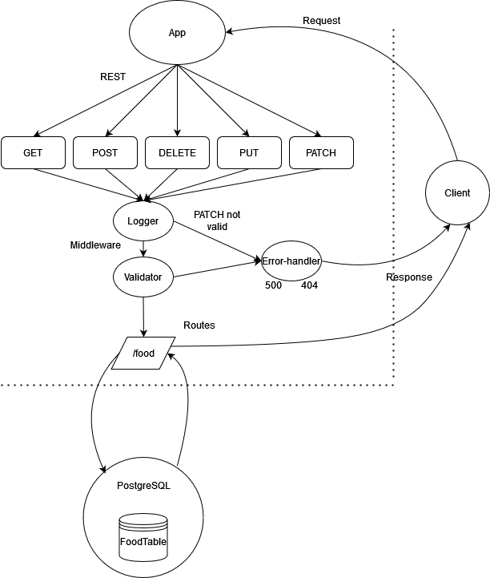

# Basic Api Server

## Installation

  clone repo, and then run the 'npm i' command while in the root directory to install dependencies.

## Summary of Problem Domain

  Application created with the purpose practicing the following:
  
  Testing middleware, routes, and database operations using Jest

  Creating an express API that follows the REST standard and performs CRUD operations on a SQL DB

## Links to application deployment

  App deployed on Heroku [here](https://basic-api-server-lab03.herokuapp.com/)

  Pull req from dev found [here]()

## Uml Diagram

## Routes

* REST Method GET
  * Path: /food
    * returns all food items in db as an array
  * Path: /food/:id
    * returns the specified food item with supplied id

* REST Method POST
  * Path: /food
    * takes a JSON obj as input and returns the record that was added to the DB

* REST Method UPDATE
  * Path: /food/:id
    * takes a JSON obj as input and returns the record that was updated in the DB, with updated data included

* REST Method DELETE
  * Path: /food/:id
    * deletes the record with the specified id and returns the deleted item upon successful deletion
